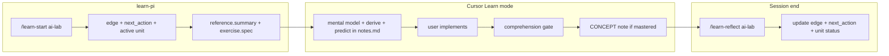

# learn-pi integration

ai-lab and [learn-pi](https://github.com/osguild/learn-pi) are complementary systems. learn-pi is the **session CMS** (re-entry, edges, reflection); ai-lab is the **knowledge repo** (exercises, notes, concept notes, research).

## Division of responsibility

| Concern | learn-pi (`~/.pi/learn/`) | ai-lab (this repo) |
|---------|---------------------------|-------------------|
| Re-entry | `next_action`, `edge` | — |
| Session closure | `/learn-reflect` updates edge + next action | `notes.md` session sections |
| Curriculum sequence | `material_graph.units` | `lab/NN-*/`, `docs/learning-path.md` |
| Concept brief per unit | `unit.reference.summary` | exercise `.md`, `docs/concepts/` |
| Exercise task | `unit.exercise.spec` | `lab/NN-*/exercises/*.md` |
| Verify | `unit.exercise.test_command` | exercise "done when" + mastery criteria |
| Durable knowledge | glossary (terms) | `docs/concepts/CONCEPT-*.md` |
| Research loop | deferred yaks | `docs/limitations/`, `research/techniques/` |

Neither system replaces the other. learn-pi answers "what do I do in the next 45 minutes?"; ai-lab answers "what do I know, and what can I prove?"

## Track record

The ai-lab track lives at `~/.pi/learn/tracks/ai-lab.json` with `work_dir` pointing to this repo.

**Install the seed** (first time only):

```bash
cp docs/learn-pi/ai-lab-track.seed.json ~/.pi/learn/tracks/ai-lab.json
# Add to index if missing — or run /learn-status in pi after editing index.json
```

Update `work_dir` in the seed if your clone path differs from `/Users/brandonly/gitrepos/ai-lab`.

## Session flow (Cursor + learn-pi)



### At session start (agents)

1. Read `~/.pi/learn/tracks/ai-lab.json` if it exists (or ask the user for their active track).
2. Resolve the **active unit** — first `in_progress`, else first `active` with an exercise.
3. Read the linked ai-lab files:
   - `unit.reference.sources` → exercise `.md`, module `README.md`, concept notes
   - `lab/NN-*/notes.md` for prior session context
4. Align with Learn mode: mental model → derive → predict before code.

### At session end (user in pi)

Run `/learn-reflect ai-lab` to:

- Update `edge` and `next_action` for re-entry
- Advance `exercise.status` on the unit worked
- Log the session; increment or reset `stall_counter`

Cursor agents should **remind** the user to reflect if a session closes without it — learn-pi owns persistence, not Cursor.

## Mapping units to ai-lab files

Each `material_graph` unit links to repo paths via `reference.sources` and `exercise.starter_path`:

| Unit id | ai-lab exercise | Concept note |
|---------|-----------------|--------------|
| `m01-ex01-tokenization` | `lab/01-foundations/exercises/01-tokenization.md` | `docs/concepts/CONCEPT-tokenization.md` |
| `m01-ex02-attention-hand` | `lab/01-foundations/exercises/02-attention-by-hand.md` | — |
| `m01-ex03-attention-code` | `lab/01-foundations/exercises/03-attention-in-code.md` | — |
| `m01-ex04-mini-transformer` | `lab/01-foundations/exercises/04-mini-transformer.md` | — |

Module 02+ units are added to the track as you progress (via `/learn-plan` or by updating the seed).

## Glossary sync

learn-pi `track.glossary` holds short definitions for dashboard visibility. Polished explanations live in `docs/concepts/`. When a concept note reaches **mastered**, add or update the matching glossary entry:

```
/learn-glossary add ai-lab "BPE" "Byte-pair encoding — ..."
```

Or run `/learn-glossary scan` after adding unit-guide markdown (future).

## Commands reference

| Command | When |
|---------|------|
| `/learn-start ai-lab` | Begin a session — surfaces edge, next action, active exercise |
| `/learn-reflect ai-lab` | End session — updates track, advances units |
| `/learn-plan edge ai-lab "..."` | Revise the current learning edge |
| `/learn-status ai-lab` | Check stall counter, unit progress |
| `/learn-dashboard start` | Visual track browser at `127.0.0.1:7331` |
| `/learn-yaks add ai-lab "..."` | Defer tangents without losing them |

## Pi vs Cursor

- **Pi** (`pi -e ~/gitrepos/learn-pi`): best for `/learn-start`, `/learn-reflect`, timer, cues, dashboard.
- **Cursor** (this repo): best for multi-file exercises, agent-assisted review, concept note authoring.

Use the same track record regardless of which agent hosts the session. The Learn skill in `.cursor/skills/learn/SKILL.md` reads learn-pi state when present.
